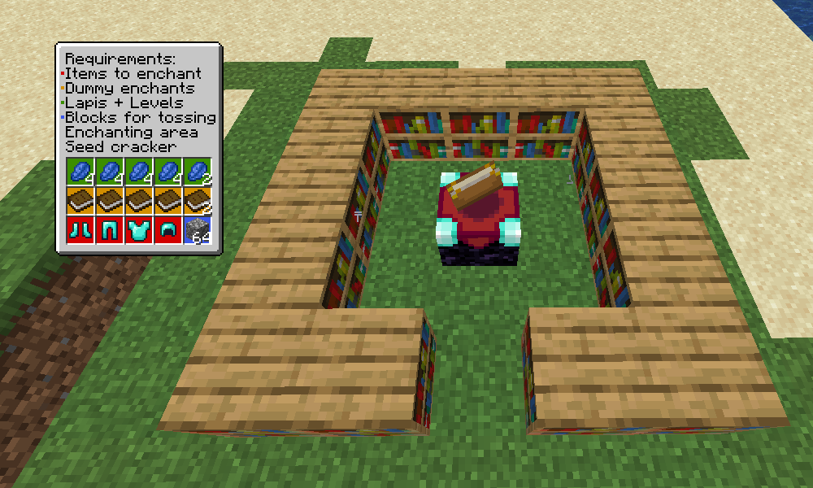
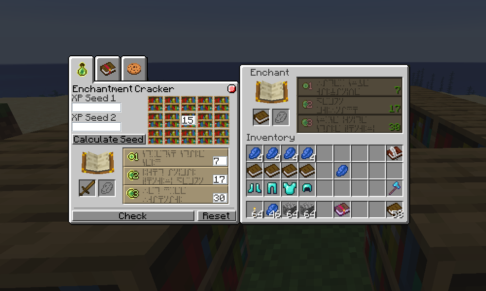
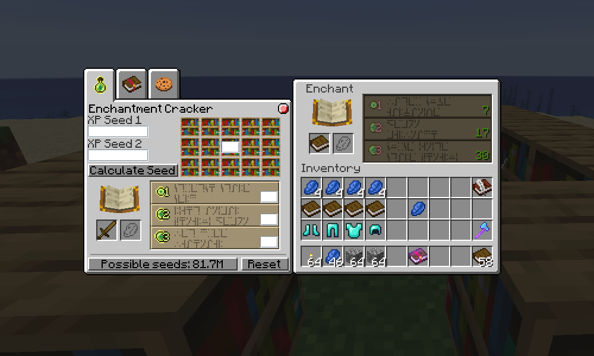
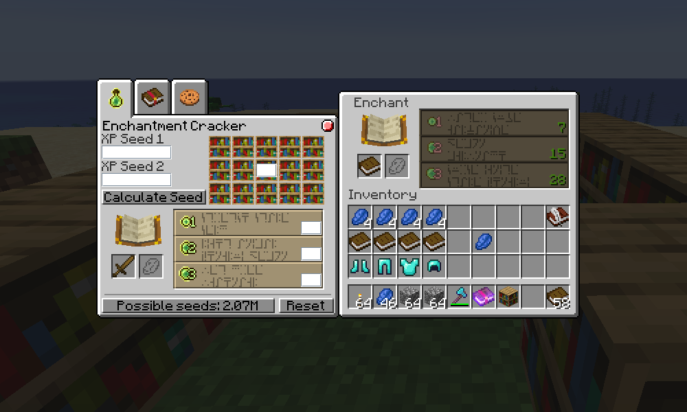
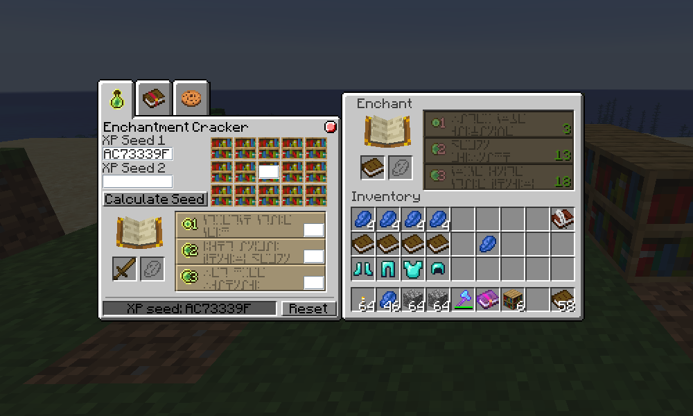
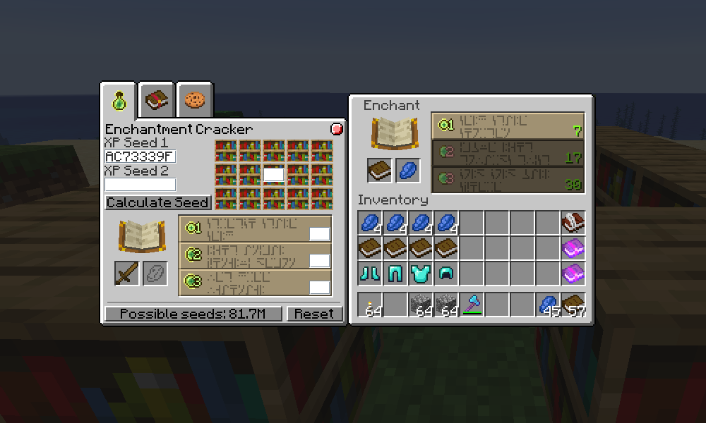
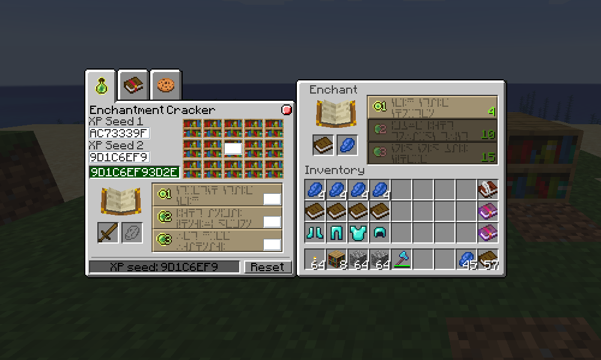
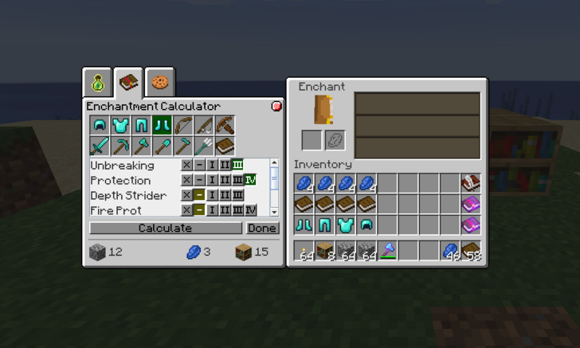
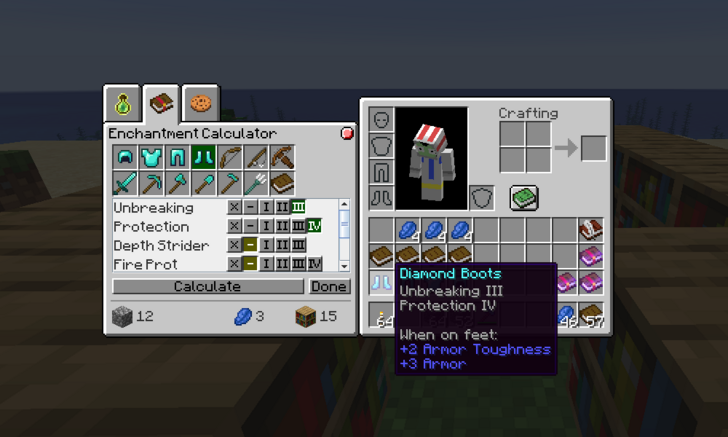

# MC Enchantment Cracker Tutorial
*Uploaded Jul 6*

In this album I'll be explaining how to use the Enchantment Cracker tool.

You will need:
- Whatever items you want to enchant.
- The same number of items for dummy enchantments, plus 2 more.
- Lapis and levels for enchanting. 4 lapis+levels per enchanted item, plus 2 more lapis and 33 more levels.
- An enchanting area that has easily manipulable bookshelves (I used a silk-touch axe).
- [The seed cracking tool](https://github.com/Earthcomputer/EnchantmentCracker/).
This all needs to be obtained before starting.

In this example I want to enchant a full set of diamond armour, so I need:
- That armour
- 6 dummy enchantables (I used books)
- 18 lapis (4 per piece + 2)
- 45 levels (4 per piece + 33)
- Enchant area + cracking tool

**IMPORTANT:** Do not do anything else during the entire process. A lot of things update your player seed, and if you do any of those things the entire process must be started over. This is why everything must be obtained before starting, as most (if not all) forms of xp farming will update your player seed, and getting everything else can also do the same.

**Step 1:** Priming your enchanting seed
-	To ensure that your enchanting seed is correct to start with, enchant a dummy item with 1 lapis and 1 level. Your enchanting seed is only updated after doing an enchantment, but your player seed (which the enchanting seed comes from) can be updated from a multitude of things, such as dropping items - which is used to our advantage later.
-	Do not toss the dummy enchantment item on the ground. This will change your player seed and break the process. You can however put it into a chest.
Step 2: Fill in the enchanting info on the cracker
-	Put the number of bookshelves into the number field over the shelves on the tool, and put the level requirements in below that. It should look like the image above. 

**Step 3:** Search for the first seed
-	Press "Check" and wait for it to find what seeds you could have.
-	Once it finishes it will tell you how many seeds fit the info you gave.

**Step 4:** Keep searching
-	Reduce the number of bookshelves by 1, and put in the info again. This will reduce the number of seeds you could have. 

 Keep doing this until...

**Step 5:** First seed found
-	You've found the first enchanting seed. This will automatically be entered into "XP Seed 1".
-	Usually this happens once you get down to 10 bookshelves, but I actually still had 2 possible seeds at 10.
-	If it instead says "No possible seeds", press "Reset" and start again from step 2.
-	This usually means that you entered some information incorrectly, but it can also mean that the server you're playing on does things differently, in which case the tool can't be used

**Step 6:** Search for the second seed

Press "Reset", repeat steps 1-5 again.

**Step 7:** Found second seed

You now have both enchanting seeds. Which means...

**Step 8:** Calculate player seed
-	You can now press "Calculate Seed", and if all goes well it will work out your full player seed.
-	If this step fails, you may have to start over.
-	However, if you forgot to enchant a dummy item before working out the first seed, you can replace the first seed with the second seed (leaving the second seed blank), and go back to step 6.
-	Now comes the fun part: Exploiting mechanics for profit!

**Step 9:** Pick your desired enchantments
Now that you have your player seed, you can pick the item you're enchanting at the top (currently only supports diamond equipment - not sure why you would enchant leather/wood/iron/gold) and select which enchantments you want below.
-	If you do not want an enchantment, press X next to it.
-	If you want an enchantment, press 1-5 (or + if it only has one level) next to it.
-	If you do not care about an enchantment, leave it.
-	When picking a desired enchantment, the level you pick is the minimum level. You might get an enchantment result that is better than what you specified.
-	Once you've picked out your enchantments, press "Calculate" and information will appear below:
    + Cobblestone: How many single items to drop (large amounts show number of stacks for convenience, but you still drop one at a time)
    + Lapis: How many levels to spend
    + Bookshelves: How many bookshelves to use

*Note:* Whilst some enchantments do list their full levels, such as sharpness 5, these are practically impossible to obtain via enchanting alone. They are only listed because they are actually possible to obtain, just extremely rare, so it's worthwhile to check to potentially save a bit of experience farming.

*Congratution, you have obtained the most powerful enchantment in Minecraft <3*