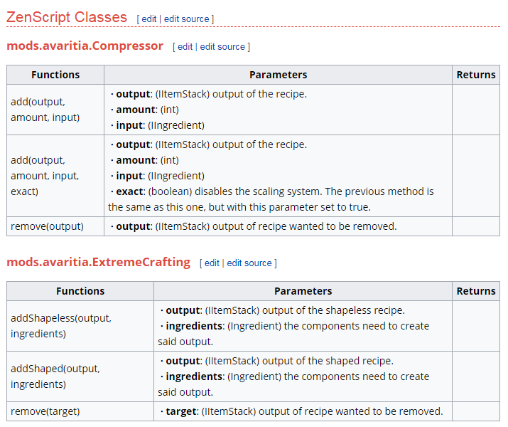

# ***CraftTweaker//ModTweaker Recipe Information***

*Below is the format method used, this has changed for 1.12+ as apposed to previous usages.*

## CraftTweaker commands are:

```
mods.avaritia.ExtremeCrafting.addShapeless("name",output, ingredients);

mods.avaritia.ExtremeCrafting.addShaped("name",output, ingredients);

mods.avaritia.ExtremeCrafting.remove(output);

mods.avaritia.Compressor.add(output, amount, input); 
//(amount is an int)

mods.avaritia.Compressor.add(output, amount, input, false); 
//(if you want the recipe to use the scaling system)
```